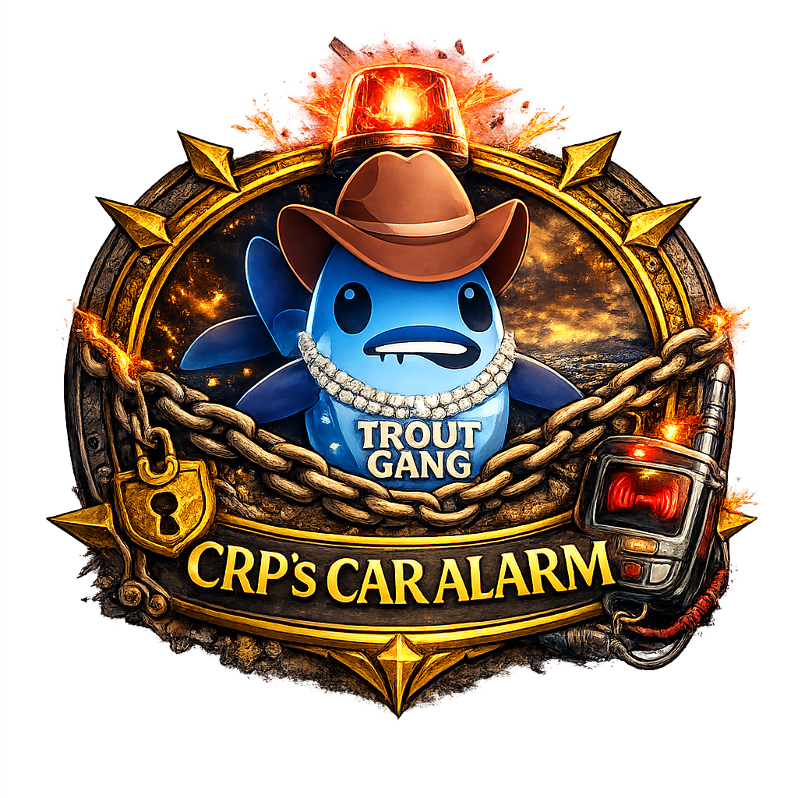

# Crp Car Alarm

Because forgetting `Owner's Mark` on the ride is funny exactly once.

`Crp Car Alarm` keeps the important reminder where you can actually see it:

- tracks `Owner's Mark` on your tracked target vehicle.
- shows a compact launcher icon and main status window
- supports standalone warning text and warning icon widgets
- includes slider controls for launcher, warning text, and warning icon size
- escalates through armed, warning, critical, and missing states

## Install

1. Install via Addon Manager.
2. Make sure the addon is enabled in game.
3. Click the launcher icon to show or hide the main window.

Saved data lives in `nuzi-ownersmark/.data` so widget positions and settings survive updates.

## Quick Start

1. Target your vehicle and set Track Target.
2. Let the addon watch `Owner's Mark` on that ride.
3. Move the launcher, main window, warning text, and warning icon where you want them.
4. Use the main window sliders to size the launcher and warning widgets to fit your UI.

This is basically the addon version of someone yelling "hey, your ride is about to get stolen!"

## How To

### Main Window

The main window shows:

- current `Owner's Mark` state
- tracked vehicle and owner
- overlay controls for the warning text and warning icon

Use it when you want the full status panel visible.

### Warning Text

The warning text widget is a separate floating overlay.

You can:

- toggle it on or off
- resize it with a slider
- cycle its color preset
- move it independently

### Warning Icon

The warning icon widget is also a separate floating overlay.

You can:

- toggle it on or off
- resize it with a slider
- move it independently

## Notes

- The addon remembers the vehicle you last targeted and can continue warning from cached mark timers unless you track your vehicle.
- Main window, launcher icon, warning text, and warning icon all save their positions.
- Window settings are stored in `.data/settings.txt` so updates do not ship over someone else's layout.
- Moving windows follows the same `Shift + drag` behavior as the other Nuzi addons.

2.0.0
